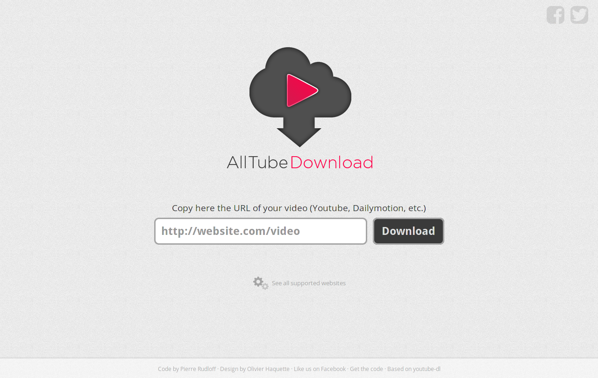

# AllTube Download

HTML GUI for youtube-dl



## Setup

### From a release package

You can download the latest release package [here](https://github.com/Rudloff/alltube/releases).

You just have to unzip it on your server and it should be ready to use.

### From Git

In order to get AllTube working,
you need to use [Composer](https://getcomposer.org/):

```bash
composer install
```

This will download all the required dependencies.

You should also ensure that the *templates_c* folder has the right permissions:

```bash
chmod 770 templates_c/
```

(You need to adapt this to your permission model.
You can find more information about this [in the Smarty documentation](https://www.smarty.net/docsv2/en/installing.smarty.basic.tpl#id2778738).)

If your web server is Apache,
you need to set the `AllowOverride` setting to `All` or `FileInfo`.

#### Update

When updating from Git, you need to run Composer again:

```bash
git pull
composer install
```

### On Heroku

[](https://heroku.com/deploy)

### On Cloudron

Cloudron is a complete solution for running apps on your server and keeping them up-to-date and secure.

[](https://cloudron.io/store/net.alltubedownload.cloudronapp.html)

The source code for the package can be found [here](https://git.cloudron.io/cloudron/alltube-app).

## Config

If you want to use a custom config, you need to create a config file:

```bash
cp config/config.example.yml config/config.yml
```

## PHP requirements

You will need PHP 7.2 (or higher) and the following PHP modules:

* intl
* mbstring
* gmp

## Web server configuration

If you want to serve the application under a basepath and/or with a different internal than external port (scenario: nginx->docker setup) Alltube supports the following X-Forwarded headers:

* X-Forwarded-Host (ex. `another.domain.com`)
* X-Forwarded-Path (ex: `/alltube`)
* X-Forwarded-Port (ex: `5555`)
* X-Forwarded-Proto (ex: `https`)

### Apache

The following modules are recommended:

* mod_mime
* mod_rewrite
* mod_expires
* mod_filter
* mod_deflate
* mod_headers

### Nginx

Here is an example Nginx configuration:

```nginx
server {
        server_name localhost;
        listen 443 ssl;

        root /var/www/path/to/alltube;
        index index.php;

        access_log  /var/log/nginx/alltube.access.log;
        error_log   /var/log/nginx/alltube.error.log;

        types {
                text/html   html htm shtml;
                text/css    css;
                text/xml    xml;
                application/x-web-app-manifest+json   webapp;
        }

        # Deny access to dotfiles
        location ~ /\. {
                deny all;
        }

        location / {
                try_files $uri /index.php?$args;
        }

        location ~ \.php$ {
                try_files $uri /index.php?$args;

                fastcgi_param     PATH_INFO $fastcgi_path_info;
                fastcgi_param     PATH_TRANSLATED $document_root$fastcgi_path_info;
                fastcgi_param     SCRIPT_FILENAME $document_root$fastcgi_script_name;

                fastcgi_pass unix:/var/run/php5-fpm.sock;
                fastcgi_index index.php;
                fastcgi_split_path_info ^(.+\.php)(/.+)$;
                fastcgi_intercept_errors off;

                fastcgi_buffer_size 16k;
                fastcgi_buffers 4 16k;

                include fastcgi_params;
        }
}
```

## Other dependencies

You need [ffmpeg](https://ffmpeg.org/)
in order to enable conversions.
(Conversions are disabled by default.)

On Debian-based systems:

```bash
sudo apt-get install ffmpeg
```

If your ffmpeg binary is not installed at `/usr/bin/ffmpeg`, you also need to edit the `ffmpeg` variable in `config.yml`.

## Use as a library

The `Video` class is now available as [a separate package](https://packagist.org/packages/rudloff/alltube-library)
so that you can reuse it in your projects.

## JSON API

We also provide a JSON API that you can use like this:
`/json?url=https%3A%2F%2Fwww.youtube.com%2Fwatch%3Fv%3DdQw4w9WgXcQ`

It returns a JSON object generated by youtube-dl.
You can find a list of all the properties [in the youtube-dl documentation](https://github.com/ytdl-org/youtube-dl#output-template).

## FAQ

Please read the [FAQ](resources/FAQ.md) before reporting any issue.

## License

This software is available under the [GNU General Public License](http://www.gnu.org/licenses/gpl.html).
